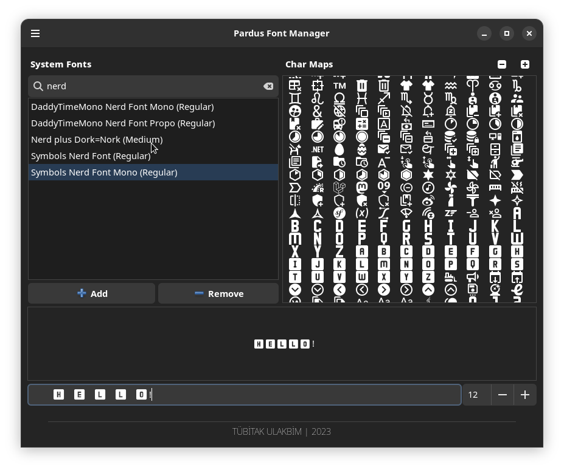

[🇹🇷](README_TR.md) [🇬🇧](README.md)

# Pardus Font Manager

## Introduction
Pardus Font Manager is a versatile application for Linux users, designed to
manage and preview fonts with ease.
This application allows users to add new fonts to their system, preview them,
and manage existing fonts. 

## Installation

### Prerequisites
- Ensure you have `fontconfig` and Python 3.x installed on your system.
- GTK 3.0 and Python bindings for GTK are required.

### Usage
- Clone the repository:

    ```
    git clone https://github.com/pardus/pardus-font-manager.git
    ```

- To start the application, run:
    `python3 Main.py`

### Interface

The main window shows a list of fonts and their details:



### Font Management Features
- Easy addition of new fonts to the system.
- Preview fonts without installing them.
- Manage and organize existing fonts.
- View detailed information about each font.

## Developer Notes
`MainWindow.py` is the main file for the application's interface.
It uses `font_charmaps.py` and `font_viewer.py` for font preview and character
map functionalities.

`font_adder.c` is a C-based module compiled as a shared library for adding fonts to the system.
